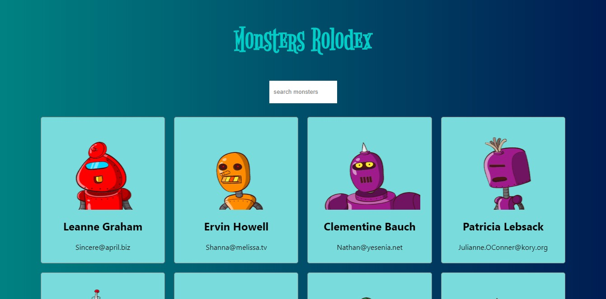

# monster-rolodex
react app, monster rolodex

This is a quick side project as part of a Udemy course. It will use the json placeholder api to get contact info, then it will use a illustration of robots 
from an different api.

https://robohash.org/  
https://jsonplaceholder.typicode.com

This project showed how to combine several api into one to provide a card that 
used both info. Css to give a hover effect for individual cards.
